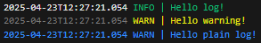

# Simple logger

- Provides colorized or plain output on the console.
- Uses ISO timestamp with milliseconds.
- NOT thread-safe - each go-routine should create own logger instance.
- Color output can be switched off with `NoColor` option of log creation.
- Color output has two variants - with light or dark foreground. Actual colors depend on terminal settings.

Sample use -
```
	lightLogger := fancylogger.NewLogger(os.Stdout, fancylogger.LiteFg)
	lightLogger.Info().Msg("Hello log!")

	darkLogger := fancylogger.NewLogger(os.Stdout, fancylogger.DarkFg)
	darkLogger.Warn().Msg("Hello warning!")

	noColorLogger := fancylogger.NewLogger(os.Stdout, fancylogger.NoColor)
	noColorLogger.Warn().Msg("Hello plain log!")
```
The output - 

 ## Notes
